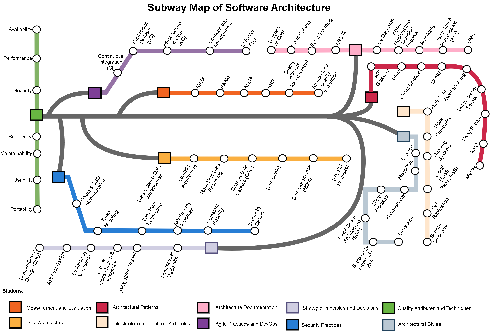

# 🗺️ Subway Map of Software Architecture (SMoSA)

The **Subway Map of Software Architecture (SMoSA)** is a **visual knowledge framework** designed to represent the complex ecosystem of software architecture concepts, practices, and decisions through the metaphor of a **metro map**.  
Each **line** represents a thematic domain of architectural knowledge (e.g., *Quality Attributes, Architectural Styles, DevOps, Security*), and each **station** represents a key concept, pattern, or reference from the literature.

SMoSA aims to **connect theoretical foundations, modern practices, and empirical insights** in a cohesive and intuitive structure to support **architectural learning, assessment, and communication**.

---

## 🧩 Structure

The SMoSA is organized into **10 main lines** (in current view), each containing multiple stations.  
Below are examples of lines and corresponding stations:

| Line | Description |
|------|--------------|
| **Strategic Principles and Decisions** | Covers the principles, philosophies, and critical decisions that form the foundation for creating and evolving a high-quality software architecture. |
| **Quality Attributes and Techniques** | Defines non-functional requirements and fundamental techniques to ensure that the architecture is robust, resilient, and efficient. |
| **Architectural Styles** | Presents high-level paradigms that define the structural organization of a system and how its main components interrelate. |
| **Architectural Patterns** | MVC, MVVM, API Gateway, Saga, Circuit Breaker, CQRS, Event Sourcing, Database per Service, Proxy Pattern |
| **Infraestructure and Distributed Architecture** | Addresses cloud service models and the inherent challenges of distributed systems, such as communication, data consistency, and service location. |
| **Data Architecture** | Focuses on patterns and styles related to data management, storage, processing, and flow at scale. |
| **Security Practices** | Covers essential practices, models, and technologies to integrate security into all architectural layers from the design stage. |
| **Agile and DevOps Practices** | Covers methodologies and processes that integrate Agile and DevOps principles to promote continuous delivery, automation, and architectural evolution. |
| **Architecture Documentation** | Presents methods, notations, and tools to effectively visualize, communicate, and record architectural decisions and structure for all stakeholders. |
| **Measurement and Evaluation** | Focuses on formal methods and techniques to objectively analyze, measure, and validate the quality and trade-offs of a software architecture. |

| Line Name | Station | Reference |
|------------|----------|------------|
| **Strategic Principles and Decisions** | Domain-Driven Design (DDD) | EVANS, Eric. *Domain-Driven Design: Tackling Complexity in the Heart of Software.* Boston: Addison-Wesley, 2003. |
| **Strategic Principles and Decisions** | API-First Design | GOUGH, James; BRYANT, Daniel; AUBURN, Matthew. *Mastering API Architecture: Design, Operate, and Evolve API-Based Systems.* Sebastopol: O’Reilly Media, 2022. |
| **Strategic Principles and Decisions** | Evolutionary Architecture | FORD, Neal; PARSONS, Rebecca; KUA, Patrick. *Building Evolutionary Architectures: Support Constant Change.* Sebastopol: O’Reilly Media, 2017. |
| **Strategic Principles and Decisions** | Legacy Modernization & Integration | NEWMAN, Sam. *Monolith to Microservices: Evolutionary Patterns to Transform Your Monolith.* Sebastopol: O’Reilly Media, 2019. |
| **Strategic Principles and Decisions** | SOLID, DRY, KISS, YAGNI | MARTIN, Robert C. *Clean Architecture: A Craftsman’s Guide to Software Structure and Design.* Boston: Prentice Hall, 2017. |
| **Strategic Principles and Decisions** | Separation of Concerns | PARNAS, David L. *On the Criteria to Be Used in Decomposing Systems into Modules.* *Communications of the ACM*, v. 15, n. 12, p. 1053–1058, 1972. |
| **Strategic Principles and Decisions** | High Cohesion & Low Coupling | BALDWIN, Carliss Y.; CLARK, Kim B. *Design Rules: The Power of Modularity.* Cambridge: MIT Press, 2000. |
| **Principles and Strategic Decisions** | Architectural Trade-offs | KAZMAN, Rick; KLEIN, Mark; CLEMENTS, Paul; et al. *The Architecture Tradeoff Analysis Method (ATAM): A Method for Evaluating Software Architectures.* Pittsburgh: Carnegie Mellon University, Software Engineering Institute, 2000. (CMU/SEI-2000-TR-004). |
| **Quality Attributes and Techniques** | Availability | ISO/IEC 25010:2023 – *Systems and Software Quality Requirements and Evaluation (SQuaRE) – System and Software Quality Models.* Geneva: ISO, 2023. |
| **Quality Attributes and Techniques** | Performance | ISO/IEC 25010:2023 – *Systems and Software Quality Requirements and Evaluation (SQuaRE) – System and Software Quality Models.* Geneva: ISO, 2023. |
| **Quality Attributes and Techniques** | Security | ISO/IEC 25010:2023 – *Systems and Software Quality Requirements and Evaluation (SQuaRE) – System and Software Quality Models.* Geneva: ISO, 2023. |
| **Quality Attributes and Techniques** | Scalability | GORTON, Ian. *Foundations of Scalable Systems: Designing Distributed Architectures.* Sebastopol: O’Reilly Media, 2022. |
| **Quality Attributes and Techniques** | Maintainability | ISO/IEC 25010:2023 – *Systems and Software Quality Requirements and Evaluation (SQuaRE) – System and Software Quality Models.* Geneva: ISO, 2023. |
| **Quality Attributes and Techniques** | Usability | ISO/IEC 25010:2023 – *Systems and Software Quality Requirements and Evaluation (SQuaRE) – System and Software Quality Models.* Geneva: ISO, 2023. |
| **Quality Attributes and Techniques** | Portability | ISO/IEC 25010:2023 – *Systems and Software Quality Requirements and Evaluation (SQuaRE) – System and Software Quality Models.* Geneva: ISO, 2023. |
| **Quality Attributes and Techniques** | Load Balancing | DAVIS, Cornelia. *Cloud Native Patterns: Designing Change-tolerant Software.* Shelter Island: Manning Publications, 2019. |
| **Quality Attributes and Techniques** | Redundancy & Failover | BEYER, Betsy et al. *Site Reliability Engineering: How Google Runs Production Systems.* Sebastopol: O’Reilly Media, 2016. |
| **Quality Attributes and Techniques** | Disaster Recovery | HEWITT, Eben. *Technology Strategy Patterns: Architecture as Strategy.* Sebastopol: O’Reilly Media, 2018. |
| **Quality Attributes and Techniques** | Partitioning/Sharding | KLEPPMANN, Martin. *Designing Data-Intensive Applications: The Big Ideas Behind Reliable, Scalable, and Maintainable Systems.* Sebastopol: O’Reilly Media, 2017. |
| **Architectural Styles** | Monolithic | NEWMAN, Sam. *Monolith to Microservices: Evolutionary Patterns to Transform Your Monolith.* Sebastopol: O’Reilly Media, 2019. |
| **Architectural Styles** | Layered | RICHARDS, Mark. *Software Architecture Patterns.* Sebastopol: O’Reilly Media, 2015. |
| **Architectural Styles** | Microservices | NEWMAN, Sam. *Building Microservices: Designing Fine-Grained Systems.* 2nd ed. Sebastopol: O’Reilly Media, 2021. |
| **Architectural Styles** | Event-Driven Architecture (EDA) | STOPFORD, Ben. *Designing Event-Driven Systems: Concepts and Patterns for Streaming Services with Apache Kafka.* Sebastopol: O’Reilly Media, 2018. |
| **Architectural Styles** | Service-Oriented Architecture (SOA) | ERL, Thomas. *Service-Oriented Architecture: Concepts, Technology, and Design.* Upper Saddle River: Prentice Hall, 2005. |
| **Architectural Styles** | Hexagonal | COCKBURN, Alistair. *The Hexagonal Architecture.* 2005. Available at: https://alistair.cockburn.us/hexagonal-architecture/ |
| **Architectural Styles** | Serverless | SBARSKI, Peter. *Serverless Architectures on AWS: With Examples Using AWS Lambda.* Shelter Island: Manning Publications, 2017. |
| **Architectural Styles** | Clean Architecture | MARTIN, Robert C. *Clean Architecture: A Craftsman’s Guide to Software Structure and Design.* Boston: Prentice Hall, 2017. |
| **Architectural Styles** | BFF | NEWMAN, Sam. *Building Microservices: Designing Fine-Grained Systems.* 2nd ed. Sebastopol: O’Reilly Media, 2021. |
| **Architectural Styles** | Micro Frontend | GEERS, Michael. *Micro Frontends in Action.* Shelter Island: Manning Publications, 2020. |
| **Architectural Styles** | MACH | MACH ALLIANCE. *What is MACH?* Available at: https://machalliance.org |
| **Architectural Patterns** | MVC | GAMMA, Erich; HELM, Richard; JOHNSON, Ralph; VLISSIDES, John. *Design Patterns: Elements of Reusable Object-Oriented Software.* Boston: Addison-Wesley, 1994. |
| **Architectural Patterns** | MVVM | MICROSOFT. *The MVVM Pattern.* Available at: https://learn.microsoft.com/en-us/dotnet/desktop/wpf/data/mvvm-overview |
| **Architectural Patterns** | API Gateway | NEWMAN, Sam. *Building Microservices: Designing Fine-Grained Systems.* 2nd ed. Sebastopol: O’Reilly Media, 2021. |
| **Architectural Patterns** | Saga | RICHARDSON, Chris. *Microservices Patterns: With Examples in Java.* Shelter Island: Manning Publications, 2018. |
| **Architectural Patterns** | Circuit Breaker | NYGARD, Michael T. *Release It!: Design and Deploy Production-Ready Software.* 2nd ed. Raleigh: Pragmatic Bookshelf, 2018. |
| **Architectural Patterns** | CQRS | MICROSOFT. *CQRS Pattern.* Microsoft Learn. Available at: https://learn.microsoft.com/en-us/azure/architecture/patterns/cqrs |
| **Architectural Patterns** | Event Sourcing | EVANS, Eric. *Domain-Driven Design: Tackling Complexity in the Heart of Software.* Boston: Addison-Wesley, 2003. |
| **Architectural Patterns** | Proxy Pattern | LARMAN, Craig. *Applying UML and Patterns: An Introduction to Object-Oriented Analysis and Design and Iterative Development.* 3rd ed. Upper Saddle River: Prentice Hall, 2004. |
| **Infraestructure and Distributed Architecture** | IaaS | ERL, Thomas; PUTTINI, Ricardo; MAHMOOD, Zaigham. *Cloud Computing: Concepts, Technology & Architecture.* Boston: Prentice Hall, 2013. |
| **Infraestructure and Distributed Architecture** | PaaS | ERL, Thomas; PUTTINI, Ricardo; MAHMOOD, Zaigham. *Cloud Computing: Concepts, Technology & Architecture.* Boston: Prentice Hall, 2013. |
| **Infraestructure and Distributed Architecture** | Multicloud | KAVIS, Michael J. *Architecting the Cloud: Design Decisions for Cloud Computing Service Models (SaaS, PaaS, and IaaS).* Hoboken: Wiley, 2014. |
| **Infraestructure and Distributed Architecture** | Edge Computing | CAO, Jie; ZHANG, Quan; SHI, Weisong. *Edge Computing: A Primer.* In: SHI, Weisong; DUSTDAR, Schahram. *Edge Computing: Models, Technologies and Applications.* Cham: Springer, 2019. p. 3–28. |
| **Infraestructure and Distributed Architecture** | Eventual Consistency | GILBERT, Seth; LYNCH, Nancy. *Brewer’s Conjecture and the Feasibility of Consistent, Available, Partition-Tolerant Web Services.* *ACM SIGACT News*, v. 33, n. 2, p. 51–59, 2002. |
| **Infraestructure and Distributed Architecture** | Data Replication | KLEPPMANN, Martin. *Designing Data-Intensive Applications.* Sebastopol: O’Reilly Media, 2017. |
| **Infraestructure and Distributed Architecture** | Queuing Systems | KLEPPMANN, Martin. *Designing Data-Intensive Applications.* Sebastopol: O’Reilly Media, 2017. |
| **Infraestructure and Distributed Architecture** | Service Discovery | RICHARDSON, Chris. *Microservices Patterns: With Examples in Java.* Shelter Island: Manning Publications, 2018. |
| **Data Architecture** | Data Mesh | DEHGHANI, Zhamak. *Data Mesh: Delivering Data-Driven Value at Scale.* Sebastopol: O'Reilly Media, 2022. |
| **Data Architecture** | Data Lakes & Data Warehouses | KIMBALL, Ralph; ROSS, Margy. *The Data Warehouse Toolkit: The Definitive Guide to Dimensional Modeling.* 3rd ed. Hoboken: Wiley, 2013. |
| **Data Architecture** | Lambda Architecture | MARZ, Nathan; WARREN, James. *Big Data: Principles and Best Practices of Scalable Realtime Data Systems.* Shelter Island: Manning Publications, 2015. |
| **Data Architecture** | Real-Time Data Streaming | AKIDAU, Tyler; CHERNYAK, Slava; LAX, Reuven. *Streaming Systems: The What, Where, When, and How of Large-Scale Data Processing.* Sebastopol: O’Reilly Media, 2018. |
| **Data Architecture** | Change Data Capture (CDC) | KLEPPMANN, Martin. *Designing Data-Intensive Applications.* Sebastopol: O’Reilly Media, 2017. |
| **Data Architecture** | Data Governance | SEINER, Robert S. *Non-Invasive Data Governance: The Path of Least Resistance and Greatest Success.* Basking Ridge: Technics Publications, 2014. |
| **Data Architecture** | Data Quality | MCGILVRAY, Danette. *Executing Data Quality Projects: Ten Steps to Quality Data and Trusted Information.* Burlington: Morgan Kaufmann, 2008. |
| **Data Architecture** | ETL/ELT Processes | KIMBALL, Ralph; CASERTA, Joe. *The Data Warehouse ETL Toolkit: Practical Techniques for Extracting, Cleaning, Conforming, and Delivering Data.* Indianapolis: Wiley, 2004. |
| **Security Practices** | Secure by Design | JOHNSSON, Dan Bergh; DEOGUN, Daniel; SAWANO, Daniel. *Secure by Design.* Shelter Island: Manning Publications, 2020. |
| **Security Practices** | Zero Trust Architecture | NIST. *Zero Trust Architecture.* NIST SP 800-207. Gaithersburg: NIST, 2020. |
| **Security Practices** | Threat Modeling | SHOSTACK, Adam. *Threat Modeling: Designing for Security.* Indianapolis: Wiley, 2014. |
| **Security Practices** | OAuth & SSO Authentication | RICHER, Justin; SANSO, Antonio. *OAuth 2 in Action.* Shelter Island: Manning Publications, 2017. |
| **Security Practices** | API Security Practices | MADDEN, Neil. *API Security in Action.* Shelter Island: Manning Publications, 2020. |
| **Security Practices** | Container Security | MOUAT, Adrian. *Using Docker: Developing and Deploying Software with Containers.* Sebastopol: O’Reilly Media, 2015. |
| **Agile and DevOps Practices** | Continuous Integration (CI) | HUMBLE, Jez; FARLEY, David. *Continuous Delivery: Reliable Software Releases through Build, Test, and Deployment Automation.* Boston: Addison-Wesley, 2010. |
| **Agile and DevOps Practices** | Continuous Delivery (CD) | HUMBLE, Jez; FARLEY, David. *Continuous Delivery: Reliable Software Releases through Build, Test, and Deployment Automation.* Boston: Addison-Wesley, 2010. |
| **Agile and DevOps Practices** | Infrastructure as Code (IaC) | MORRIS, Kief. *Infrastructure as Code: Dynamic Systems for the Cloud Age.* 2nd ed. Sebastopol: O’Reilly Media, 2021. |
| **Agile and DevOps Practices** | Observability & Monitoring | SRIDHARAN, Cindy. *Distributed Systems Observability.* Sebastopol: O’Reilly Media, 2018. |
| **Agile and DevOps Practices** | Configuration Management | LIMONCELLI, Thomas A.; HOGAN, Christina J.; CHALUP, Strata R. *The Practice of System and Network Administration.* 3rd ed. Boston: Addison-Wesley, 2016. |
| **Agile and DevOps Practices** | 12-Factor App | WIGGINS, Adam. *The Twelve-Factor App.* [S.l.]: Heroku, 2011. Available at: https://12factor.net/ |
| **Agile and DevOps Practices** | Architecture at Scale (SAFe, LeSS) | LEFFINGWELL, Dean; KNASTER, Richard; JEMILO, Drew. *SAFe® 6.0 Reference Guide: Scaled Agile Framework® for Lean Enterprises.* Boston: Addison-Wesley, 2023. |
| **Architecture Documentation** | ADRs (Architecture Decision Records) | CLEMENTS, Paul C. et al. *Documenting Software Architectures: Views and Beyond.* 2nd ed. Boston: Addison-Wesley, 2010. |
| **Architecture Documentation** | UML | BOOCH, Grady; RUMBAUGH, James; JACOBSON, Ivar. *The Unified Modeling Language User Guide.* 2nd ed. Boston: Addison-Wesley, 2005. |
| **Architecture Documentation** | Viewpoints & Perspectives (4+1) | KRUCHTEN, Philippe. *Architectural Blueprints—The “4+1” View Model of Software Architecture.* *IEEE Software*, v. 12, n. 6, p. 42–50, 1995. |
| **Architecture Documentation** | Event Storming | BRANDOLINI, Alberto. *Introducing EventStorming: An Act of Deliberate Collective Learning.* Milano: Leanpub, 2019. |
| **Measurement and Evaluation** | ATAM | BASS, Len; CLEMENTS, Paul; KAZMAN, Rick. *The Architecture Tradeoff Analysis Method.* Pittsburgh: SEI, Carnegie Mellon University, 2001. |
| **Measurement and Evaluation** | SAAM | KAZMAN, Rick; ABOWD, Gregory; BASS, Len; CLEMENTS, Paul. *Scenario-Based Analysis of Software Architecture.* *IEEE Software*, 1996. |
| **Measurement and Evaluation** | ALMA | BENGTSSON, P.; LASSING, N.; BOSCH, J.; VAN VLIET, H. *Architecture-Level Modifiability Analysis (ALMA).* *Journal of Systems and Software*, v. 69, n. 1–2, p. 129–147, 2004. |
| **Measurement and Evaluation** | AHP | SAATY, Thomas L. *The Analytic Hierarchy Process: Planning, Priority Setting, Resource Allocation.* New York: McGraw-Hill, 1980. |
| **Measurement and Evaluation** | Architectural Quality Evaluation | KAZMAN, Rick; KLEIN, Mark H.; CLEMENTS, Paul. *Evaluating Software Architectures: Methods and Case Studies.* Boston: Addison-Wesley, 2002. |
| **Measurement and Evaluation** | Quality Attribute Measurement | KAZMAN, Rick; KLEIN, Mark H.; CLEMENTS, Paul. *Evaluating Software Architectures: Methods and Case Studies.* Boston: Addison-Wesley, 2002. |
